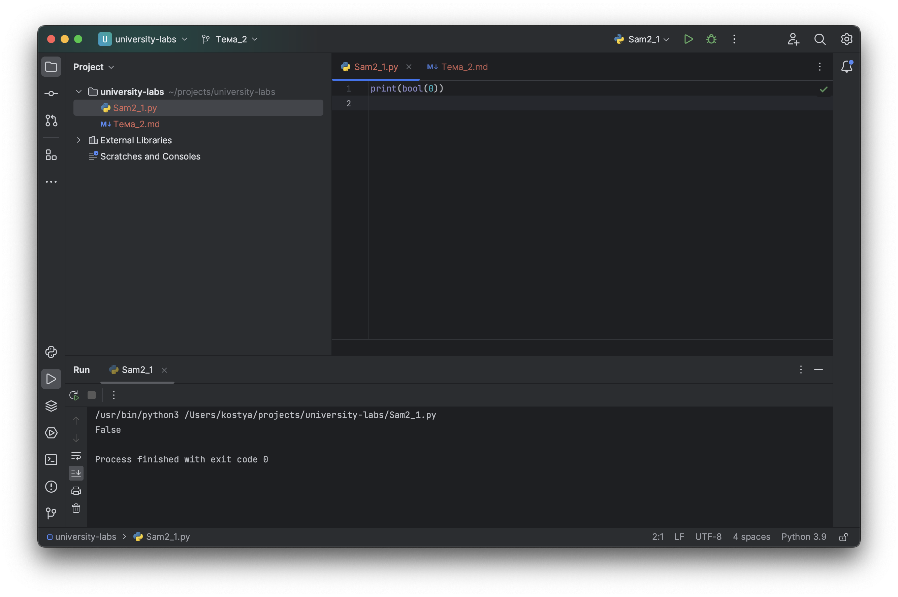

# Тема 2. Базовые операции языка Python
Отчет по Теме #2 выполнил(а):
- Бушуев Константин Сергеевич
- ЗПИЭ-20-1

| Задание    | Сам_раб |
|------------|---------|
| Задание 1  | +       |
| Задание 2  | +       |
| Задание 3  | +       |
| Задание 4  | +       |
| Задание 5  | +       |
| Задание 6  | +       |
| Задание 7  | +       |
| Задание 8  | +       |
| Задание 9  | -       |
| Задание 10 | -       |

знак "+" - задание выполнено; знак "-" - задание не выполнено;

Работу проверили:
- к.э.н., доцент Панов М.А.

## Самостоятельная работа №1
### Выведите в консоль булевую переменную False, не используя слово False в строке или изначально присвоенную булевую переменную. Программа должна занимать не более двух строк редактора кода.

```python
print(bool(0))
```
### Результат.


## Выводы

В данном коде используется приобразование числа `0` к булевому значению `False` при помощи функции `bool()`

## Самостоятельная работа №2
### Присвоить значения трем переменным и вывести их в консоль, используя только две строки редактора кода

```python
one = 1; two = 2; three = 3
print(one, two, three)
```


## Выводы

Для того, чтобы объявить несколько переменных в одной строке их нужно разделить между собой `;`. Если не указать данный разделитель, то будет ошибка `SyntaxError`

## Самостоятельная работа №3
### Реализуйте ввод данных в программу, через консоль, в виде только целых чисел (тип данных int). То есть при вводе буквенных символов в консоль, программа не должна работать. Программа должна занимать не более двух строк редактора кода.

```python
print(int(input('Введите текущий год: ')))
```


## Выводы

Для того, чтобы на вход вводить только числа, то необходимо функцию `input()` обернуть в `int()`: `int(input())`. Если попробовать ввести символы отличные от букв, то будет ошибка `ValueError`
  
## Самостоятельная работа №4
### Создайте только одну строковую переменную. Длина строки должна не превышать 5 символов. На выходе мы должны получить строку длиной не менее 16 символов. Программа должна занимать не более двух строк редактора кода.

```python
str = 'hello'
print(str, str, str, str, sep='')
```


## Выводы

В функцию `print()` можно передавать более одной переменной и благодаря этому при помощи строки в 5 символов на выходе мы получили строку в 20 символов

## Самостоятельная работа №5
### Создайте три переменные: день (тип данных - числовой), месяц (тип данных - строка), год (тип данных - числовой) и выведите в консоль текущую дату в формате: “Сегодня день месяц год. Всего хорошего!” используя F строку и оператор end внутри print(), в котором вы должны написать фразу “Всего хорошего!”. Программа должна занимать не более двух строк редактора кода.

```python
day = 22; month = 'сентября'; year = 2023
print(f'Сегодня {day} {month} {year}. ', end='Всего хорошего!')
```


## Выводы

Для того, чтобы вывести значения переменный используется `f-строка`. А для вывода фразы "Всего хорошего" используется аргумент `end`

## Самостоятельная работа №6
### В предложении ‘Hello World’ вставьте ‘my’ между двумя словами. Выведите полученное предложение в консоль в одну строку. Программа должна занимать не более двух строк редактора кода.

```python
phrase = 'Hello World'
print(phrase.replace(' ', ' my '))
```


## Вывод
Для того, чтобы между двумя словами вставить `my` можно воспользоваться функцией `replace` заменим пробел на ` my `

## Самостоятельная работа №7
### Узнайте длину предложения ‘Hello World’, результат выведите в консоль. Программа должна занимать не более двух строк редактора кода.

```python
print(len('Hello World'))
```


## Выводы

Функция `len()` позволяет узнать длину переданной строки

## Самостоятельная работа №8
### Переведите предложение ‘HELLO WORLD’ в нижний регистр. Программа должна занимать не более двух строк редактора кода.

```python
print('HELLO WORLD'.lower())
```


## Выводы

Для того, чтобы привести строку к нижнему регистру необходимо воспользоваться функцией lower()

## Лабораторная работа №9
- Текст задания
- Оформленный код
- Скрины консоли
- Краткие Выводы

## Лабораторная работа №10
- Текст задания
- Оформленный код
- Скрины консоли
- Краткие Выводы

## Самостоятельная работа №1
- Текст задания
- Оформленный код
- Скрины консоли
- Развернутый вывод
  
## Самостоятельная работа №2
- Текст задания
- Оформленный код
- Скрины консоли
- Развернутый вывод
  
## Самостоятельная работа №3
- Текст задания
- Оформленный код
- Скрины консоли
- Развернутый вывод
  
## Самостоятельная работа №4
- Текст задания
- Оформленный код
- Скрины консоли
- Развернутый вывод
  
## Самостоятельная работа №5
- Текст задания
- Оформленный код
- Скрины консоли
- Развернутый вывод
  
## Самостоятельная работа №6
- Текст задания
- Оформленный код
- Скрины консоли
- Развернутый вывод
  
## Самостоятельная работа №7
- Текст задания
- Оформленный код
- Скрины консоли
- Развернутый вывод
  
## Самостоятельная работа №8
- Текст задания
- Оформленный код
- Скрины консоли
- Развернутый вывод
  
## Самостоятельная работа №9
- Текст задания
- Оформленный код
- Скрины консоли
- Развернутый вывод
  
## Самостоятельная работа №10
- Текст задания
- Оформленный код
- Скрины консоли
- Развернутый вывод

## Общие выводы по теме
- Развернутый вывод
